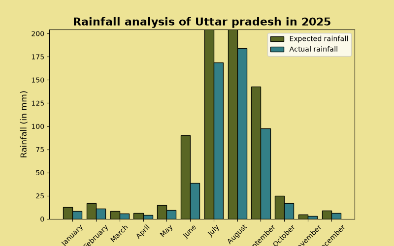
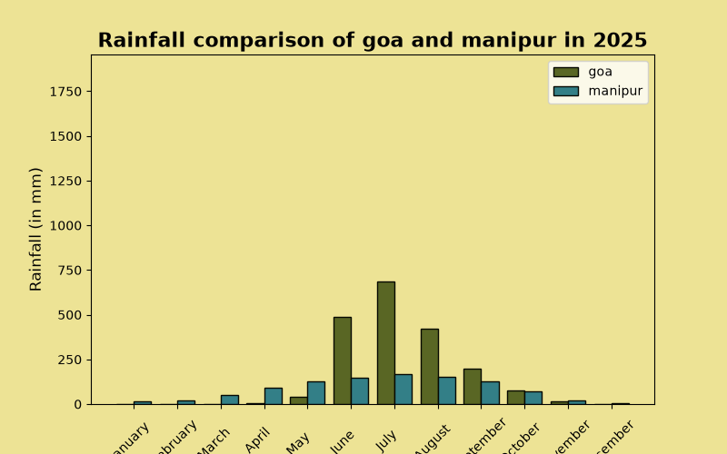

# Rainfall_Statistics

Project on analysis of rainfall in states of India. 
Matplotlib and NumPy libraries are used in this project.

The rainfall data is fictional and hasn't been collected from an official source.

The project uses :
1. Files
2. Lists
3. Loops
4. Conditional statements
5. Basic statistical calculations
6. Data visualization
7. Taking input from user.

Precautions :
1. State name must be spelled correctly.

This project uses simple python functions and libraries to :
1. Analyse rainfall statistics of a state in India in 2025
   - Displays expected and actual monthly rainfall
   - Calculates the wettest month
   - Calculates the driest month
   - Calculates average rainfall
   - Calculates the rainfall range
   - Displays a bar chart comparing expected and actual rainfall
2. Compare rainfall statistics of any 2 states in 2025
   - Compares actual monthly rainfall
   - Identifies which state received more total rainfall
   - Compares average rainfall
   - Displays a comparison bar chart

The code has a pre-defined files of rainfall data of every state on India in year 2025.

The code asks you to choose between 1 or 2, 1 to analyse rainfall statistics of a state and 2 to compare rainfall statistics of 2 states.

If you choose 1, the code asks you for which state do you want your analysis about. Then it fetch data from files and then print it to you, does calculations about rainfall statistics and also print bar chart of expected and actual rainfall in that state in 2025.

If you choose 2, the code will ask you for your input on states which you want to compare. Then it will fetch data from file and then print it in a comparison side to side format to you, does basic comparison calculations and also print bar chart for comparison of actual rainfall in both states in 2025.

If the user doesn't enter a valid state or enter wrong spelling, the code tells the user to try again and code stops.

Example : (If you choose option 1 i.e. to analyse rainfall statistics)
====================
Rainfall Statistics
====================
What do you want to do?
1. Analyse rainfall statistics of a state in year 2025 
2. Compare rainfall statistics of two states in year 2025 
Enter your choice (1 or 2): 1
Enter the name of the state: Uttar pradesh
Expected rainfall in Uttar Pradesh in 2025 :
January   : 12.6  mm
February  : 16.8  mm
March     : 8.4   mm
April     : 6.2   mm
May       : 14.8  mm
June      : 90.4  mm
July      : 245.6 mm
August    : 268.9 mm
September : 142.6 mm
October   : 24.8  mm
November  : 4.6   mm
December  : 8.9   mm
Actual rainfall in Uttar Pradesh in 2025 :
January   : 8.4   mm
February  : 11.2  mm
March     : 5.6   mm
April     : 4.1   mm
May       : 9.7   mm
June      : 38.9  mm
July      : 168.7 mm
August    : 184.3 mm
September : 97.8  mm
October   : 17.1  mm
November  : 3.2   mm
December  : 6.4   mm

Wettest month of Uttar pradesh in 2025 was August with 184.3 mm of rain.
Driest month of Uttar pradesh in 2025 was November with 3.2 mm of rain.
Average rainfall in Uttar pradesh in 2025 was 46.28 mm.
Range of rainfall in Uttar pradesh in 2025 was 181.1 mm.

Example : (If you choose option 2 i.e. to compare rainfall statistics of any two states)
====================
Rainfall Statistics
====================
What do you want to do?
1. Analyse rainfall statistics of a state in year 2025 
2. Compare rainfall statistics of two states in year 2025 
Enter your choice (1 or 2): 2
Enter the name of the first state: goa
Enter the name of the second state: Manipur
Expected rainfall in Goa in 2025 : | Expected rainfall in Manipur in 2025 :
January   : 1.2   mm | January   : 18.6  mm
February  : 0.8   mm | February  : 24.3  mm
March     : 2.5   mm | March     : 62.8  mm
April     : 12.6  mm | April     : 118.5 mm
May       : 68.4  mm | May       : 168.4 mm
June      : 933.8 mm | June      : 198.7 mm
July      : 896.6 mm | July      : 215.6 mm
August    : 487.6 mm | August    : 202.4 mm
September : 310.5 mm | September : 168.9 mm
October   : 265.8 mm | October   : 98.6  mm
November  : 22.6  mm | November  : 24.7  mm
December  : 4.1   mm | December  : 8.4   mm
Actual rainfall in Goa in 2025 : | Actual rainfall in Manipur in 2025 :
January   : 0.4   mm | January   : 14.2  mm
February  : 0.2   mm | February  : 18.7  mm
March     : 1.1   mm | March     : 48.4  mm
April     : 7.3   mm | April     : 91.6  mm
May       : 41.2  mm | May       : 128.9 mm
June      : 488.3 mm | June      : 148.3 mm
July      : 684.7 mm | July      : 165.8 mm
August    : 420.7 mm | August    : 152.6 mm
September : 198.7 mm | September : 126.3 mm
October   : 76.9  mm | October   : 73.4  mm
November  : 13.8  mm | November  : 17.8  mm
December  : 2.3   mm | December  : 6.1   mm

More rain poured in manipur in 2025.
Average rainfall was more in goa than manipur in 2025.

Example : (If you neither enter 1 or 2)
====================
Rainfall Statistics
====================
What do you want to do?
1. Analyse rainfall statistics of a state in year 2025 
2. Compare rainfall statistics of two states in year 2025 
Enter your choice (1 or 2): 3
Enter either 1 or 2 based on your task.

Example : (If spelling of state is wrong or you enter some string which isn't a state in India)
====================
Rainfall Statistics
====================
What do you want to do?
1. Analyse rainfall statistics of a state in year 2025 
2. Compare rainfall statistics of two states in year 2025 
Enter your choice (1 or 2): 1
Enter the name of the state: meghal
meghal is not a state in India, check spelling again.

Thank you for looking at my code, I really appreciate it.
Warm reagards
Manvi